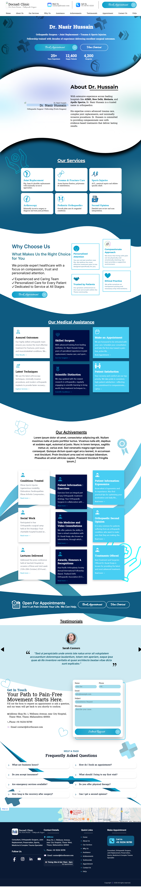

# 🦴 Dr. Nasir Hussain — Orthopaedic Portfolio

A modern, responsive portfolio website built for **Dr. Nasir Hussain**, an orthopaedic surgeon/specialist — designed to present credentials, services, and patient information in a clean and professional manner. Built with **React + Vite** and powered by **Firebase** for backend services and hosting.

---

## 🌐 Live Demo

> 🔗 [View Live Site](https://orthopaedic-portfolio-test.web.app)

---

## 📸 Preview

<!-- Add a screenshot of your project here -->


---

## ✨ Features

- ⚡ **Blazing Fast** — Built with Vite for near-instant HMR and optimized production builds
- 📱 **Fully Responsive** — Adapts seamlessly across desktop, tablet, and mobile devices
- 🔥 **Firebase Integration** — Cloud Firestore for dynamic content management and real-time data
- 🏥 **Medical Professional Design** — Clean, trustworthy UI tailored for a healthcare audience
- 🚀 **Firebase Hosting** — Deployed on Google's globally distributed CDN
- 🔒 **Firestore Security Rules** — Properly scoped database access rules

---

## 🛠️ Tech Stack

| Layer        | Technology                         |
|--------------|------------------------------------|
| **Frontend** | React 18, JavaScript (ES6+)        |
| **Build Tool** | Vite                             |
| **Styling**  | CSS3                               |
| **Backend / DB** | Firebase Firestore             |
| **Hosting**  | Firebase Hosting                   |
| **Linting**  | ESLint                             |

---

## 📁 Project Structure

```
orthopaedic-portfolio/
├── public/                  # Static assets (images, icons, fonts)
├── src/                     # React source code
│   ├── components/          # Reusable UI components
│   ├── pages/               # Page-level components
│   ├── assets/              # Images and media used in components
│   └── main.jsx             # App entry point
├── .firebaserc              # Firebase project configuration
├── firebase.json            # Firebase Hosting & Firestore config
├── firestore.indexes.json   # Firestore composite indexes
├── firestore.rules          # Firestore security rules
├── index.html               # HTML entry point
├── vite.config.js           # Vite configuration
├── eslint.config.js         # ESLint configuration
├── package.json             # Dependencies and scripts
└── requirements.txt         # Additional tooling requirements
```

---

## 🚀 Getting Started

### Prerequisites

Make sure you have the following installed:

- [Node.js](https://nodejs.org/) (v18 or above recommended)
- [npm](https://www.npmjs.com/) or [yarn](https://yarnpkg.com/)
- [Firebase CLI](https://firebase.google.com/docs/cli) — `npm install -g firebase-tools`

### Installation

```bash
# 1. Clone the repository
git clone https://github.com/Faiz-Shaikh-001/orthopaedic-portfolio.git

# 2. Navigate to the project directory
cd orthopaedic-portfolio

# 3. Install dependencies
npm install
```

### Firebase Setup

1. Go to the [Firebase Console](https://console.firebase.google.com/) and create a new project.
2. Enable **Cloud Firestore** in your project.
3. Register a **Web App** and copy your Firebase config.
4. Create a `.env` file in the project root and add your config:

```env
VITE_FIREBASE_API_KEY=your_api_key
VITE_FIREBASE_AUTH_DOMAIN=your_auth_domain
VITE_FIREBASE_PROJECT_ID=your_project_id
VITE_FIREBASE_STORAGE_BUCKET=your_storage_bucket
VITE_FIREBASE_MESSAGING_SENDER_ID=your_messaging_sender_id
VITE_FIREBASE_APP_ID=your_app_id
```

5. Log in to Firebase CLI and link your project:

```bash
firebase login
firebase use --add
```

### Running Locally

```bash
npm run dev
```

Visit `http://localhost:5173` in your browser.

---

## 📦 Available Scripts

| Command            | Description                              |
|--------------------|------------------------------------------|
| `npm run dev`      | Start the development server with HMR    |
| `npm run build`    | Build the project for production         |
| `npm run preview`  | Preview the production build locally     |
| `npm run lint`     | Run ESLint to check for code issues      |

---

## ☁️ Deployment

This project is configured for **Firebase Hosting**.

```bash
# Build the project
npm run build

# Deploy to Firebase Hosting
firebase deploy
```

Your site will be live at: `https://orthopaedic-portfolio-test.web.app`

---

## 🔐 Firestore Security Rules

The project includes Firestore security rules in `firestore.rules`. Make sure to review and update them before going to production to ensure your data is properly protected.

---

## 🤝 Contributing

Contributions, issues and feature requests are welcome!

1. Fork the repository
2. Create your feature branch: `git checkout -b feature/your-feature-name`
3. Commit your changes: `git commit -m 'Add some feature'`
4. Push to the branch: `git push origin feature/your-feature-name`
5. Open a Pull Request

---

## 📄 License

This project is open source and available under the [MIT License](LICENSE).

---

## 👤 Author

**Faiz Shaikh**

- GitHub: [@Faiz-Shaikh-001](https://github.com/Faiz-Shaikh-001)

---

> Built with ❤️ using React, Vite, and Firebase
