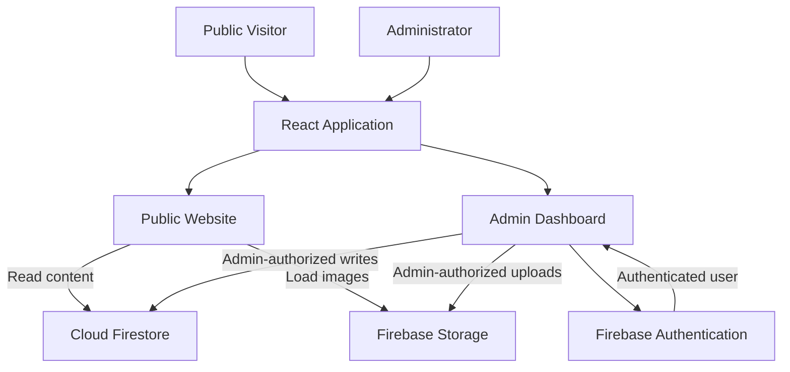
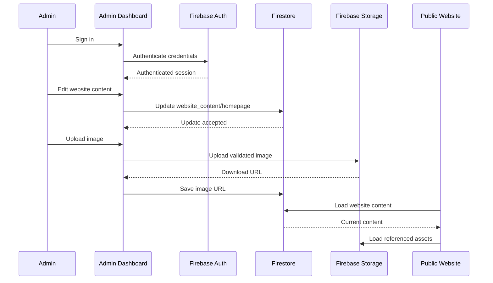
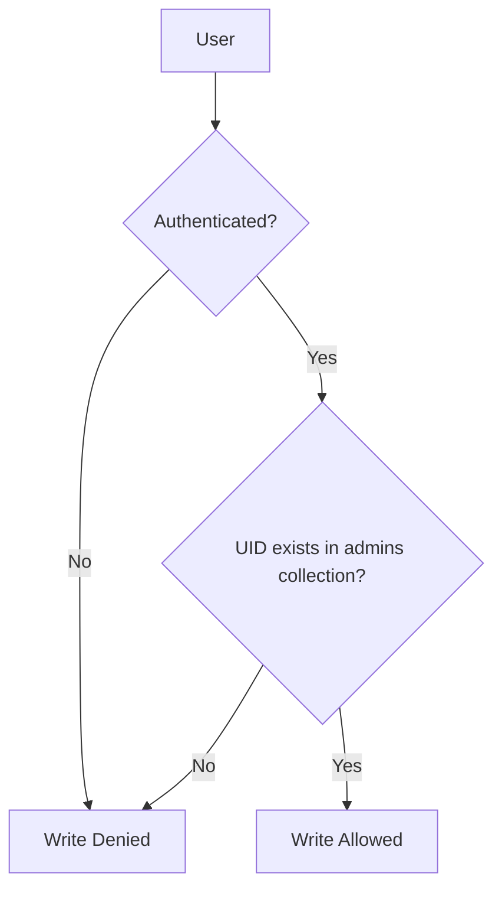

# Orthopaedic Portfolio

A full-stack portfolio and content-management platform built for an orthopaedic specialist.

The application combines a responsive public-facing medical website with an authenticated administration dashboard that allows website content and media to be updated without modifying the source code.

**Live Site:** https://orthopaedic-portfolio-test.web.app

---

## Overview

The project started as a static portfolio website and evolved into a Firebase-backed content-management system.

The public application loads website content dynamically from Cloud Firestore, while an authenticated administrator can manage sections such as services, testimonials, contact information, FAQs, appointments, and other site content through a dedicated dashboard.

Images are stored separately in Firebase Storage and referenced from Firestore documents.

---

## Key Features

### Public Website

* Responsive medical portfolio interface
* Dynamic content loaded from Cloud Firestore
* Services and medical assistance sections
* Doctor profile and professional information
* Achievements and statistics
* Patient testimonials
* FAQ section
* Appointment/contact form
* Animated UI using GSAP and Framer Motion
* Sanitized rich-text rendering using DOMPurify

### Admin CMS

* Firebase Authentication-based admin login
* Protected administration dashboard
* Content editors for individual website sections
* Dynamic Firestore updates
* Image uploads through Firebase Storage
* Immediate website content updates without source-code changes

### Security

* Public read access only for website content
* Firestore writes restricted to approved administrators
* Administrator allow-list stored separately from user authentication
* Firebase Storage writes restricted to approved administrators
* Public image reads for website assets
* Server-side image MIME-type validation
* Maximum image upload size enforced through Storage Security Rules
* Client-side image type and size validation
* Environment-based Firebase configuration
* Default-deny rules for unspecified Firestore and Storage paths

---

## Architecture


```mermaid
flowchart TD
    Visitor[Public Visitor]
    Admin[Administrator]

    React[React Application]
    PublicSite[Public Website]
    AdminCMS[Admin Dashboard]

    Auth[Firebase Authentication]
    Firestore[Cloud Firestore]
    Storage[Firebase Storage]

    Visitor --> React
    Admin --> React

    React --> PublicSite
    React --> AdminCMS

    PublicSite -->|Read content| Firestore
    PublicSite -->|Load images| Storage

    AdminCMS --> Auth
    Auth -->|Authenticated user| AdminCMS

    AdminCMS -->|Admin-authorized writes| Firestore
    AdminCMS -->|Admin-authorized uploads| Storage
```

### Content Flow


```mermaid
sequenceDiagram
    participant Admin
    participant CMS as Admin Dashboard
    participant Auth as Firebase Auth
    participant DB as Firestore
    participant Storage as Firebase Storage
    participant Site as Public Website

    Admin->>CMS: Sign in
    CMS->>Auth: Authenticate credentials
    Auth-->>CMS: Authenticated session

    Admin->>CMS: Edit website content
    CMS->>DB: Update website_content/homepage
    DB-->>CMS: Update accepted

    Admin->>CMS: Upload image
    CMS->>Storage: Upload validated image
    Storage-->>CMS: Download URL
    CMS->>DB: Save image URL

    Site->>DB: Load website content
    DB-->>Site: Current content
    Site->>Storage: Load referenced assets
```

---

## Security Model

Authentication and authorization are deliberately separated.

Signing into Firebase Authentication does **not** automatically grant CMS write access.

An authenticated user's UID must also exist in:

```text
admins/{uid}
```

Firestore Security Rules verify this administrator record before allowing content changes.

Conceptually:


```mermaid
flowchart TD
    User[User] --> Auth{Authenticated?}

    Auth -->|No| Denied[Write Denied]
    Auth -->|Yes| AdminCheck{UID exists in admins collection?}

    AdminCheck -->|No| Denied
    AdminCheck -->|Yes| Allowed[Write Allowed]
```

This prevents an arbitrary authenticated Firebase account from modifying website content.

### Firestore

Public visitors may read:

```text
website_content/*
```

Only approved administrators may create, update, or delete website content.

All unspecified Firestore paths are denied by default.

### Firebase Storage

Portfolio images are stored under:

```text
images/*
```

Public visitors may read these assets because they are displayed on the website.

Uploads and modifications require administrator authorization.

Storage rules additionally enforce:

* image MIME types
* maximum file size of 5 MB
* default-deny behavior outside the intended image directory

---

## Technology Stack

| Area                 | Technology              |
| -------------------- | ----------------------- |
| Frontend             | React 19                |
| Language             | JavaScript              |
| Build Tool           | Vite                    |
| Styling              | Tailwind CSS            |
| Routing              | React Router            |
| Authentication       | Firebase Authentication |
| Database             | Cloud Firestore         |
| Object Storage       | Firebase Storage        |
| Animation            | GSAP, Framer Motion     |
| Content Sanitization | DOMPurify               |
| Icons                | Iconify                 |
| Validation / Quality | ESLint                  |
| Deployment           | Firebase                |

---

## Project Structure

```text
orthopaedic-portfolio/
├── public/
│
├── src/
│   ├── admin/
│   │   ├── components/
│   │   ├── editors/
│   │   ├── AdminLogin.jsx
│   │   ├── AdminPanel.jsx
│   │   └── DashboardHome.jsx
│   │
│   ├── assets/
│   ├── components/
│   ├── customHooks/
│   ├── features/
│   ├── App.jsx
│   ├── PublicWebsite.jsx
│   ├── firebase.js
│   └── main.jsx
│
├── .firebaserc
├── .gitignore
├── eslint.config.js
├── firebase.json
├── firestore.indexes.json
├── firestore.rules
├── storage.rules
├── index.html
├── package.json
├── package-lock.json
└── vite.config.js
```

---

## Local Development

### Prerequisites

Install:

* Node.js 18+
* npm
* Firebase CLI or `npx firebase-tools`

Clone the repository:

```bash
git clone https://github.com/Faiz-Shaikh-001/orthopaedic-portfolio.git
cd orthopaedic-portfolio
```

Install dependencies:

```bash
npm install
```

---

## Environment Configuration

Create a `.env` file in the project root:

```env
VITE_FIREBASE_API_KEY=your_api_key
VITE_FIREBASE_AUTH_DOMAIN=your_auth_domain
VITE_FIREBASE_PROJECT_ID=your_project_id
VITE_FIREBASE_STORAGE_BUCKET=your_storage_bucket
VITE_FIREBASE_MESSAGING_SENDER_ID=your_messaging_sender_id
VITE_FIREBASE_APP_ID=your_app_id
VITE_FIREBASE_MEASUREMENT_ID=your_measurement_id

VITE_USE_FIREBASE_EMULATOR=false
```

Firebase configuration values can be obtained from:

```text
Firebase Console
→ Project Settings
→ General
→ Your Apps
→ Web App
→ SDK setup and configuration
```

The `.env` file is ignored by Git and should not be committed.

---

## Running Locally

```bash
npm run dev
```

Open:

```text
http://localhost:5173
```

The administration interface is available at:

```text
/admin
```

---

## Quality Checks

Run ESLint:

```bash
npm run lint
```

Create a production build:

```bash
npm run build
```

Preview the production build:

```bash
npm run preview
```

The repository is maintained so that both linting and production builds complete successfully.

---

## Firebase Deployment

Authenticate:

```bash
npx firebase-tools login
```

Deploy Firestore rules and indexes:

```bash
npx firebase-tools deploy --only firestore
```

Deploy Storage rules:

```bash
npx firebase-tools deploy --only storage
```

---

## Engineering Decisions

### Dynamic Content Instead of Hard-Coded Pages

Website content is stored in Firestore rather than being embedded throughout React components.

This separates presentation from content and allows non-code changes to be made through the administration interface.

### Authentication Is Not Authorization

Firebase Authentication verifies who the user is.

Authorization is handled independently through an administrator allow-list checked by Firebase Security Rules.

This prevents every authenticated Firebase account from automatically receiving administrative privileges.

### Separate Structured Data and Media

Structured website content is stored in Firestore while binary image assets are stored in Firebase Storage.

Firestore stores only the image URLs needed by the application.

### Defense in Depth for Uploads

Image validation exists at two layers:

1. Client-side validation provides immediate feedback.
2. Firebase Storage Security Rules enforce the actual security boundary.

The server-side rule remains authoritative even if the browser validation is bypassed.

### Default-Deny Security Rules

Firestore and Storage access is explicitly granted only to required paths.

Everything else is denied by default.

---

## Current Engineering Considerations

The current production bundle is functional but relatively large due to the combined React, Firebase, animation, and administration dependencies.

A future optimization pass could introduce:

* lazy-loaded administration routes
* dynamic imports
* route-level code splitting
* separate public and administration bundles
* further asset optimization

These are performance improvements rather than functional requirements.

---

## Author

**Faiz Shaikh**

Software Engineer

GitHub: https://github.com/Faiz-Shaikh-001

---

## License

This project is intended to be distributed under the MIT License.
